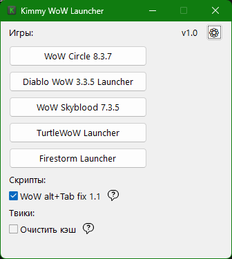

# Kimmy WoW Launcher
    

**Kimmy WoW Launcher** — это лаунчер пиратских клиентов World of Warcraft, написанный на [AutoHotkey v2](https://www.autohotkey.com/).

---

## 🚀 Возможности
- Запуск до 5 разных клиентов WoW 
- Автоматическая подстановка пароля в буфер обмена
- Поддержка пользовательских скриптов (до 5)
- Очистка кэша игры перед запуском
- Красивый GUI с настройками и подсказками

---

## 🚀 Установка и запуск
1. Скачайте и запустите [`KimmyWoWLauncher.exe`](KimmyWoWLauncher.exe).
	- Можно вместо него использовать файл [`KimmyWoWLauncher.ahk`](KimmyWoWLauncher.ahk), но для этого понадобится установка [AutoHotkey v2](https://www.autohotkey.com/)
2. Скопируйте на рабочий стол ярлыки WoW и скриптов
3. При первом старте появится файл `KimmyWoWLauncher.ini`. Отредактируйте его, указав названия ярлыков игр и скриптов, а также впишите пароли.
4. Нажмите на кнопку запуска нужной версии WoW.  

---

## 📖 Лицензия
Проект распространяется под лицензией **MIT**.  
Вы можете свободно использовать, изменять и распространять этот скрипт с указанием автора.

---