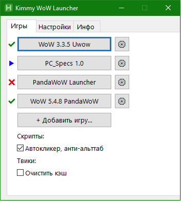

# Kimmy WoW Launcher
    

**Kimmy WoW Launcher** — это удобный и легкий лаунчер для различных клиентов World of Warcraft, написанный на [AutoHotkey v2](https://www.autohotkey.com/). Больше не нужно хранить кучу ярлыков на рабочем столе или вручную править конфиги.

---

## ✨ Возможности
- **Управление слотами:** Поддержка до 5 разных версий игры.
- **Полный GUI-интерфейс:** Добавление и настройка игр происходит через удобное меню (кнопка `⚙`), без необходимости открывать INI-файл.
- **Визуальные индикаторы:** Статус каждой игры отображается символами (✔ готов, ▶ запущено, ✖ ошибка).
- **Умное отслеживание:** мониторинг запуска и закрытия процессов игр в реальном времени.
- **Автозаполнение пароля:** Копирует заданный пароль в буфер обмена при запуске игры.
- **Поддержка ярлыков:** Вы можете выбирать как напрямую `.exe` файлы, так и `.lnk` ярлыки — лаунчер сам найдет путь к игре.
- **Очистка кэша:** Опциональное удаление папок `Cache` и `Data\Cache` перед запуском для стабильной работы.
- **Быстрый доступ:** Нажатие ПКМ по кнопке запуска открывает папку с игрой.
- **Мониторинг ресурсов:** Индикатор прогресса, отображающий потребление оперативной памяти процессом игры при его запуске.
- **Автоматическое разворачивание:** Опция восстановления окна лаунчера после закрытия игры.
- **Встроенный модуль:** "Автокликер, анти-альттаб" для комфортной игры в WoW.

---
 

## 🚀 Установка и запуск
1. Скачайте последнюю версию в разделе [Releases](https://github.com/KiM38RuS/Kimmy-WoW-Launcher/releases).
2. Запустите исполняемый файл:
	- [`KimmyWoWLauncher.exe`](KimmyWoWLauncher.exe)
	- или используйте исходный код [`KimmyWoWLauncher.ahk`](KimmyWoWLauncher.ahk) (требуется установленный [AutoHotkey v2](https://www.autohotkey.com/)).
3. Нажмите на кнопку **"+ Добавить игру"**.
4. Выберите исполняемый файл игры и, при необходимости, введите пароль от аккаунта.
5. Наслаждайтесь игрой!

---

## 📖 Лицензия
Проект распространяется под лицензией **MIT**.  
Вы можете свободно использовать, изменять и распространять этот скрипт с указанием автора.

---
