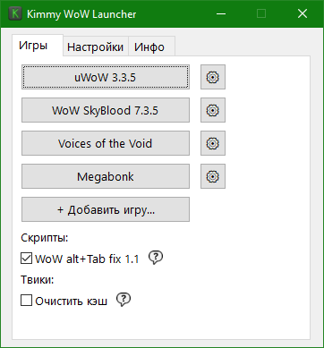

# Kimmy WoW Launcher
    

**Kimmy WoW Launcher** — это удобный и легкий лаунчер для различных клиентов World of Warcraft, написанный на [AutoHotkey v2](https://www.autohotkey.com/). Больше не нужно хранить кучу ярлыков на рабочем столе или вручную править конфиги.

---

## ✨ Возможности
- **Управление слотами:** Поддержка до 5 разных версий игры одновременно. 
- **Полный GUI-интерфейс:** Добавление и настройка игр происходит через удобное меню (кнопка `⚙`), без необходимости открывать INI-файл.
- **Автозаполнение пароля:** Копирует заданный пароль в буфер обмена при запуске игры.
- **Поддержка ярлыков:** Вы можете выбирать как напрямую `.exe` файлы, так и `.lnk` ярлыки — лаунчер сам найдет путь к игре.
- **Очистка кэша:** Опциональное удаление папок `Cache` и `Data\Cache` перед запуском для стабильной работы.
- **Быстрый доступ:** Нажатие ПКМ по кнопке запуска открывает папку с игрой.
- **Мониторинг ресурсов:** Индикатор прогресса, отображающий потребление оперативной памяти процессом игры при его запуске.

---
 

## 🚀 Установка и запуск
1. Скачайте последнюю версию в разделе [Releases](https://github.com/KiM38RuS/Kimmy-WoW-Launcher/releases).
2. Запустите исполняемый файл:
   - `KimmyWoWLauncher x64.exe` (для 64-битных систем)
   - Или используйте исходный код `KimmyWoWLauncher.ahk` (требуется установленный [AutoHotkey v2](https://www.autohotkey.com/)).
3. Нажмите на кнопку **"+ Добавить игру"** в свободном слоте.
4. Выберите исполняемый файл игры и, при необходимости, введите пароль от аккаунта.
5. Наслаждайтесь игрой!

---

## 📖 Лицензия
Проект распространяется под лицензией **MIT**.  
Вы можете свободно использовать, изменять и распространять этот скрипт с указанием автора.

---
